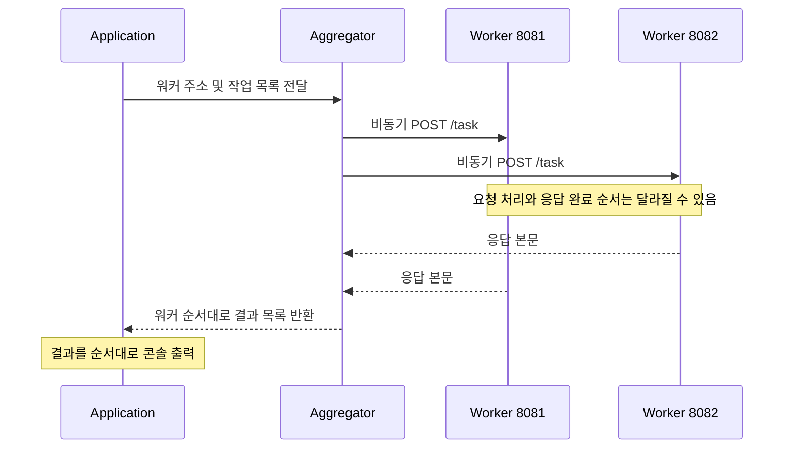

<div align="center">

# 🌐 Java Async HTTP Client

### 여러 워커에 작업을 보내고, 응답을 하나의 목록으로

**HttpClient · CompletableFuture · Async Requests · Response Aggregation**


JDK HTTP Client로 구현한 비동기 작업 전송 및 응답 취합 학습 프로젝트입니다.

[프로젝트 소개](#-프로젝트-소개) · [통신 흐름](#-통신-흐름) · [실행 방법](#-실행-방법) · [서버 저장소](https://github.com/path0971/HTTP) · [기술 블로그](https://blog.naver.com/pathfinder7777/223950124308)

</div>

---

## 📘 프로젝트 소개

**HTTPCLIENT**는 여러 HTTP 서버에 작업을 보내고 결과를 모으는 Java 클라이언트입니다. JDK의 `java.net.http.HttpClient`와 `CompletableFuture`를 이용해 응답을 기다리지 않고 요청들을 먼저 전송합니다.

예제 애플리케이션은 서로 다른 포트의 워커 두 개에 정수 곱셈 작업을 보냅니다. 각 워커의 응답 본문을 받아 **입력한 워커 순서대로** 목록에 담고 콘솔에 출력합니다.

> 서버의 연산 구현은 별도 [HTTP 저장소](https://github.com/path0971/HTTP)에 있습니다. 이 저장소는 작업 전송과 응답 취합을 담당하며, 자동 서비스 탐색이나 동적 부하 분산은 구현하지 않습니다.

## ✨ 주요 기능

| 기능 | 구현 내용 |
| --- | --- |
| **JDK HTTP Client** | 외부 HTTP 라이브러리 없이 요청 생성 및 전송 |
| **HTTP/1.1 지정** | 클라이언트 빌더에 프로토콜 버전 설정 |
| **POST 요청** | 작업 문자열을 바이트 배열로 변환하여 본문에 포함 |
| **비동기 전송** | `sendAsync()`로 여러 요청을 먼저 시작 |
| **응답 변환** | `thenApply(HttpResponse::body)`로 본문 문자열 추출 |
| **결과 취합** | `join()`으로 각 결과를 기다리고 `List<String>` 반환 |
| **순서 유지** | 완료 순서와 관계없이 워커 목록 순서로 결과 정리 |

## 🔀 통신 흐름



위 그림은 두 번째 워커가 먼저 응답하는 경우의 예시입니다. 실제 완료 순서는 서버 처리와 네트워크 상황에 따라 달라집니다.

### 비동기 전송과 결과 대기

`WebClient.sendTask()`는 다음과 같이 응답 본문을 담을 Future를 반환합니다.

```java
return client.sendAsync(request, HttpResponse.BodyHandlers.ofString())
        .thenApply(HttpResponse::body);
```

`Aggregator`는 반복문에서 요청을 모두 시작한 다음 결과를 취합합니다.

```java
List<String> results = Stream.of(futures)
        .map(CompletableFuture::join)
        .collect(Collectors.toList());
```

**전송은 비동기이지만 `sendTasksToWorkers()`의 반환은 결과가 모일 때까지 기다립니다.** `join()`이 호출 스레드를 대기시키더라도 이미 전송한 다른 요청은 진행될 수 있습니다. 정상 완료한 경우 반환 목록의 순서는 입력 워커 순서와 같습니다.

## 🗂️ 코드 구성

| 파일 | 책임 |
| --- | --- |
| [`Application.java`](src/main/java/Application.java) | 워커 주소와 예제 작업 정의, 결과 출력 |
| [`Aggregator.java`](src/main/java/Aggregator.java) | 워커별 요청 전송 및 응답 목록 취합 |
| [`networking/WebClient.java`](src/main/java/networking/WebClient.java) | HTTP 클라이언트 생성, POST 구성, 비동기 전송 |
| [`pom.xml`](pom.xml) | Java 17 빌드, 실행 JAR 생성, `Application` 진입점 설정 |

### 작업 매핑

현재 `Application.java`에는 다음 값이 정의되어 있습니다.

| 워커 | 주소 | 요청 본문 |
| --- | --- | --- |
| **01** | `http://localhost:8081/task` | `10,200` |
| **02** | `http://localhost:8082/task` | `123456789,100000000000000,700000002342343` |

워커 주소 목록의 `i`번째 항목과 작업 목록의 `i`번째 항목이 일대일로 연결됩니다. 클라이언트가 수식을 직접 계산하는 것은 아니며, 서버에서 받은 문자열을 그대로 반환합니다.

## 🚀 실행 방법

### 1. 준비 환경

- JDK 17
- Maven
- `/task` POST 요청을 처리하는 HTTP 서버 두 개

실행 예제는 연관 프로젝트인 [HTTP](https://github.com/path0971/HTTP)의 서버를 사용합니다. 서버와 클라이언트는 같은 PC의 서로 다른 프로세스로 실행할 수 있습니다.

### 2. 서버 준비

서버 저장소를 내려받고 해당 폴더에서 빌드합니다.

```powershell
git clone https://github.com/path0971/HTTP.git
cd HTTP
mvn clean package
```

**서버 터미널 A** — `HTTP` 폴더에서 실행:

```powershell
java -jar target/httpserver-1.0-SNAPSHOT.jar 8081
```

**서버 터미널 B** — 별도 터미널의 `HTTP` 폴더에서 실행:

```powershell
java -jar target/httpserver-1.0-SNAPSHOT.jar 8082
```

두 서버 터미널을 계속 열어 둡니다. 필요하면 별도 PowerShell에서 상태를 확인합니다.

```powershell
curl.exe http://localhost:8081/status
curl.exe http://localhost:8082/status
```

연관 서버의 정상 상태 응답은 `Good Good`입니다.

### 3. 클라이언트 빌드 및 실행

별도 작업 폴더에서 클라이언트 저장소를 내려받습니다.

```powershell
git clone https://github.com/path0971/HTTPCLIENT.git
cd HTTPCLIENT
mvn clean package
java -jar target/http.client-1.0-SNAPSHOT-jar-with-dependencies.jar
```

첫 번째 작업은 `2000`을 포함한 서버 응답을 출력하고, 두 번째 작업은 큰 정수 세 개를 곱한 서버 응답을 출력합니다. 정확한 접두 문구와 줄바꿈은 서버 구현에 따릅니다.

이 절차는 소스와 빌드 설정을 기준으로 작성했으며, README 작성 과정에서 두 서버를 실행하여 통합 검증한 결과는 아닙니다.

## ⚙️ 워커와 작업 변경

[`Application.java`](src/main/java/Application.java)의 주소와 작업을 수정한 뒤 다시 빌드합니다.

```java
private static final String WORKER_ADDRESS_1 = "http://localhost:8081/task";
private static final String WORKER_ADDRESS_2 = "http://localhost:8082/task";

String task1 = "10,200";
String task2 = "123456789,100000000000000,700000002342343";
```

현재 주소와 작업은 소스에 고정되어 있으며, 실행 인자나 설정 파일에서 읽는 기능은 없습니다. 원격 서버에 접속하려면 `localhost`를 해당 서버 주소로 변경합니다.

## 📝 현재 구현 범위

| 항목 | 현재 동작 |
| --- | --- |
| HTTP 상태 코드 | 검사하지 않고 응답 본문만 추출 |
| 타임아웃 | 연결·요청 타임아웃을 명시적으로 설정하지 않음 |
| 요청 실패 | `join()`에서 예외가 전파될 수 있으며 부분 성공 결과 처리 없음 |
| 작업 개수 | 워커 수보다 작업이 적으면 인덱스 오류, 많으면 초과 작업은 전송되지 않음 |
| 요청 헤더 | Content-Type 및 테스트·디버그 헤더를 별도 지정하지 않음 |
| 문자 인코딩 | 요청 문자열의 `getBytes()`에 문자셋을 명시하지 않음 |
| 워커 선택 | 고정 목록의 인덱스별 매핑; 자동 탐색·재시도·재분배 없음 |

## 🌱 확장 방향

- [ ] 주소와 작업을 실행 인자 또는 설정 파일로 분리
- [ ] 워커 수와 작업 수 검증
- [ ] HTTP 상태 코드 및 오류 응답 처리
- [ ] 타임아웃과 재시도 정책
- [ ] 실패한 워커가 있어도 부분 결과 반환
- [ ] 취합 API를 `CompletableFuture<List<String>>` 형태로 확장
- [ ] 서비스 레지스트리 기반 워커 탐색

## 📚 관련 프로젝트와 기록

| 자료 | 링크 |
| --- | --- |
| HTTP 서버 구현 | [path0971/HTTP](https://github.com/path0971/HTTP) |
| HTTP 클라이언트 개발 기록 | [기술 블로그](https://blog.naver.com/pathfinder7777/223950124308) |

---

<div align="center">

**Send Asynchronously. Collect in Order.**<br>
Java HTTP Client로 이해하는 비동기 요청과 결과 취합

</div>
